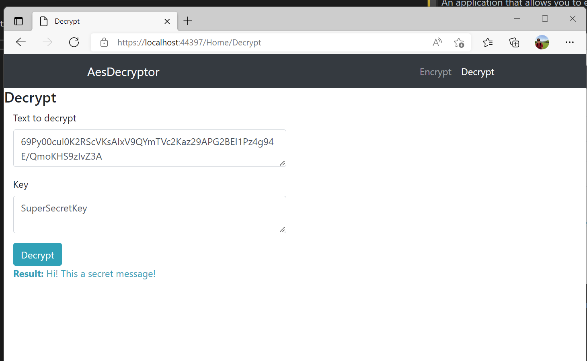

# AESDecryptor
An application that allows you to encrypt on `/Home/Encrypt` message for somebody and then send it encrypted in base64.

On the other size receiver can decrypt it on the page of web-app `/Home/Decrypt`

